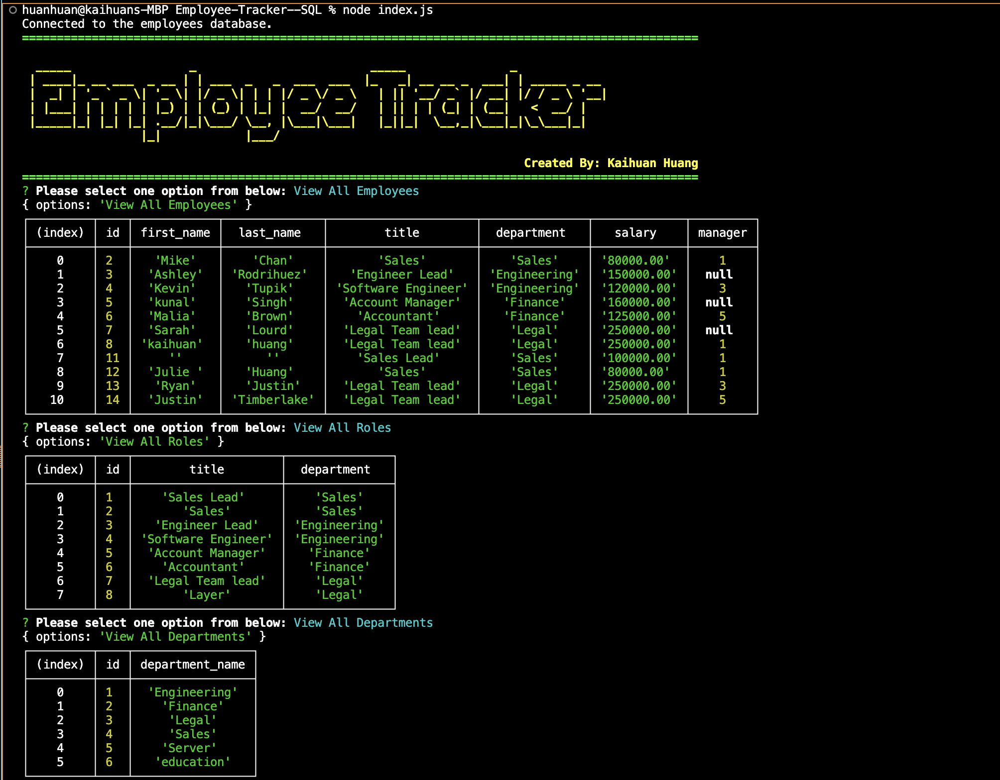
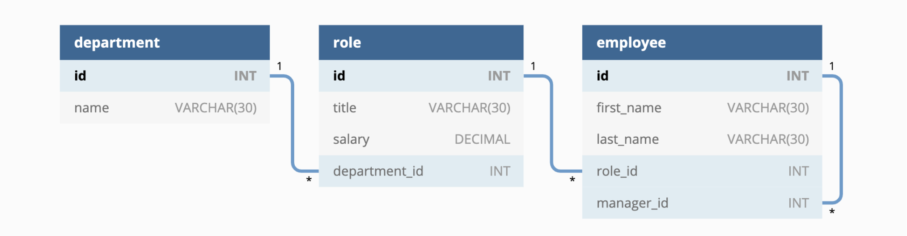

# Employee-Tracker--SQL


## Table of Contents
* [Description](#description)
* [Assets](#assets)
* [Assets](#assets)
* [Installation](#installation)
* [Usage](#usage)
* [Contributing](#contributing)
* [Questions](#questions)

## Description
The content management systems (CMS): Employee-Tracker--SQL is a command-line application from scratch to manage a company's employee database, using Node.js, Inquirer, and MySQL.

- Deployed link: https://github.com/kaihuan-huang/Employee-Tracker--SQL

- Gitpage link: https://kaihuan-huang.github.io/Employee-Tracker--SQL

## More details
```
AS A business owner
I WANT to be able to view and manage the departments, roles, and employees in my company
SO THAT I can organize and plan my business

GIVEN a command-line application that accepts user input
WHEN I start the application
THEN I am presented with the following options: view all departments, view all roles, view all employees, add a department, add a role, add an employee, and update an employee role
WHEN I choose to view all departments
THEN I am presented with a formatted table showing department names and department ids
WHEN I choose to view all roles
THEN I am presented with the job title, role id, the department that role belongs to, and the salary for that role
WHEN I choose to view all employees
THEN I am presented with a formatted table showing employee data, including employee ids, first names, last names, job titles, departments, salaries, and managers that the employees report to
WHEN I choose to add a department
THEN I am prompted to enter the name of the department and that department is added to the database
WHEN I choose to add a role
THEN I am prompted to enter the name, salary, and department for the role and that role is added to the database
WHEN I choose to add an employee
THEN I am prompted to enter the employee’s first name, last name, role, and manager, and that employee is added to the database
WHEN I choose to update an employee role
THEN I am prompted to select an employee to update and their new role and this information is updated in the database
```

## Assets

The following images demonstrate the web application's appearance and functionality:



 
## Installation 
The user should clone the repository from GitHub and download Node. 
Run `npm i ` to install.
Run `npm i inquirer figlet chalk`.
Run `node index.js ` to start the Employee-Tracker--SQL.

## Usage 
Use inquirer from your command line to answer questions about your project.
View walk through video here - [Employee-Tracker--SQL](https://youtu.be/LQ2bB67NEbk)<br>


## Contributing 
Contributors should read the installation section. 

## Technologies used
```
 Node.js
 Inquirer 
 Express.js API 
 Sequelize
 MySQL database
 Dotenv Package
```
## Questions
If you have any questions about this projects, please contact me directly at huangkaihuan0216@gmail.com. You can view more of my projects at https://github.com/kaihuan-huang.

## Made by
```
Kaihuan Huang

```